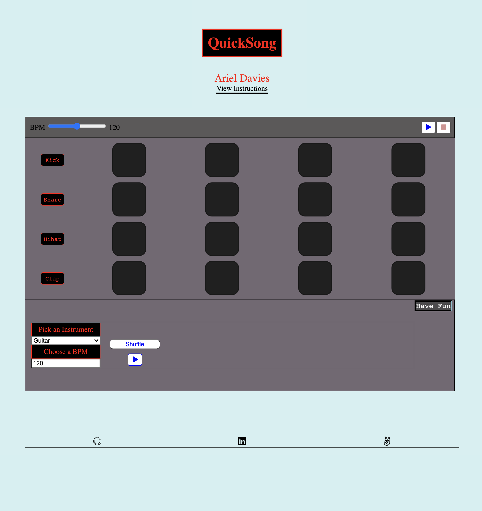
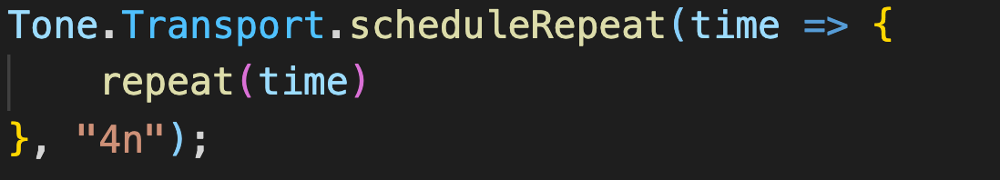
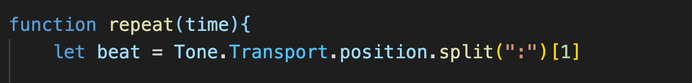
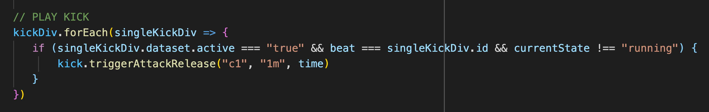

# QuickSong

### Welcome to Quicksong!

QuickSong is an interactive app where users can create custom drum patterns and can find samples to play to accompany it.

## Technologies

- Tone.js
  - Used to create custom drum instruments along with functionality for playback in rhythm at various tempos.
- FreeSound API
  - Using to access samples for users to pick based off of their query on instrument and BPM
- Javascript
  - To build an interactive front end application
- CSS
  - To style the drum pads and bring user playback to life
- HTML
  - To structure the information appropriately
- Howler.js
  - To access audio files easily and to be able to play audio files

## Code Snippets

1.  
     This is where I used the built in Transport class from the Tone.js library to schedule repeated playback of time. The time is passed into a repeat function which I'll go into further next. The second argument being passed into scheduleRepeat represents the pattern it'll be played in so "4n" stands for 4 notes.

2)  
    Repeat is taking in time here. I've defined a variable caled beat which take uses the built in method from Transport called 'position' which runs in a timed loop according to the current tempo. I am splitting the position becasue the position contains different numbers held together by ':'. The number that I need is at position 1 so that is what I key into.

3)  
     This loop triggers the playback of the kick. It is chcking if the current div from the DOM has a dataset that is set to "true" and if the current beat which we accessed up above equals the id of the current pad. So if beat 2 equals pad 2. We are also checking if the state of our web audio API is not running because we don't want to play duplicate kicks on top of eachother. Then if these conditions are met we will play the kick pasing in the key to play it in, the length to play it, and the time at which to play it.

## Features

- Users adjust the BPM which controls the speed of playback for each drum sound
- Each instrument contains four pads where users can click on to trigger the playback of the instrument on that beat at the speed of the BPM
- The pads light up as yellow when the drum pads are playing regardless of whether an individual pad has been chosen
- Below the sequencer users can also choose an instrument and a BPM. By clicking Shuffle it will generate a random sample that can be played to accompany the drums.

<!-- ## MVP List

### Drums functionality 7/26-7/28

- Users can choose what pattern to play their drums by clicking on a drum box to play it or not play it
- Users can adjust the volume of each drum

### Sample Functionality 7/28-7/29

- Users can choose an audio sample based off of instrument and BPM
- The audio sample will come from a sample site API
- Users can adjust the volume

### Bonus 7/29-7/30

- Users can share their quickSong with friends by sharing the link

## Wireframe

 -->
