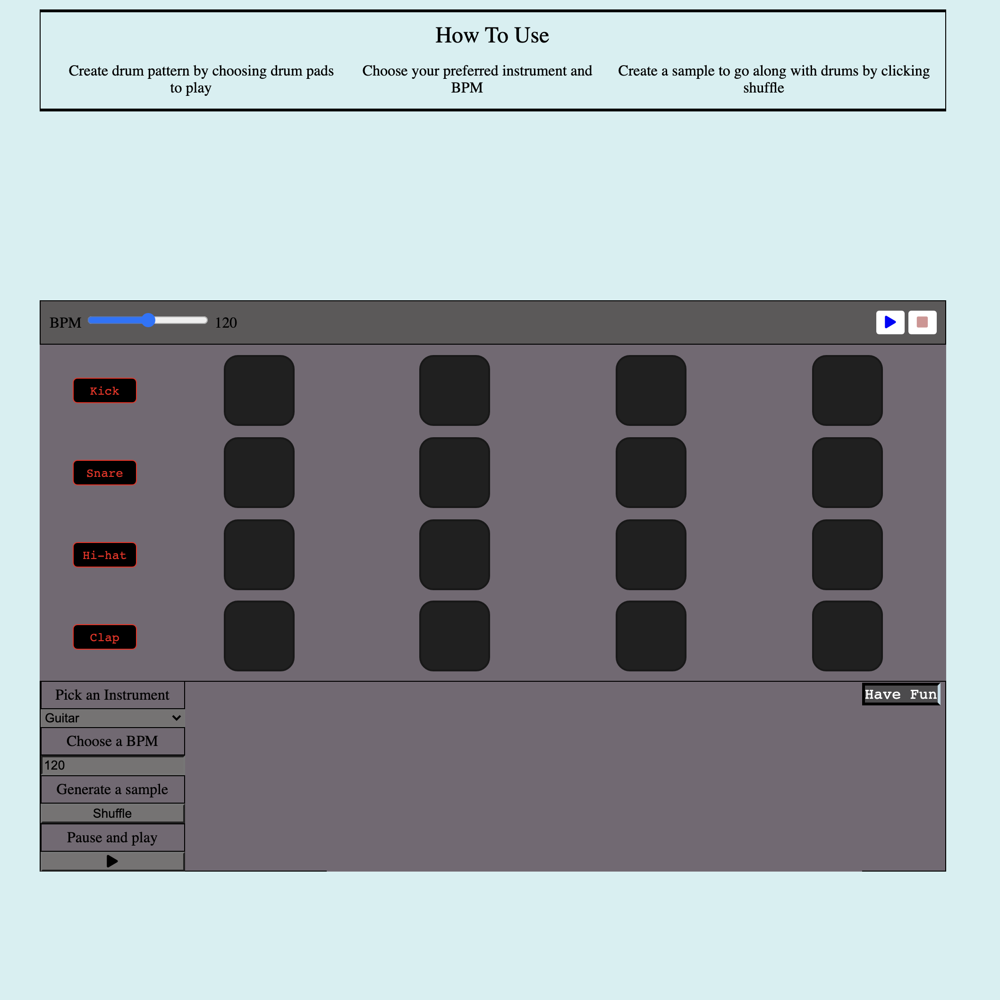
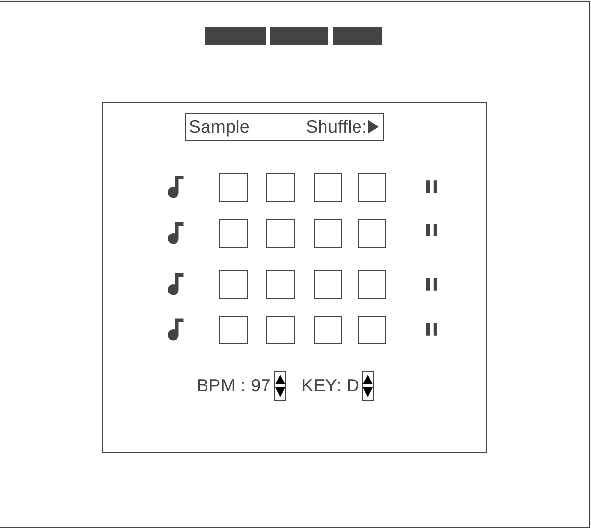

# QuickSong

### Welcome to Quicksong!

QuickSong is an interactive app where users can create custom drum patterns and can find samples to play to accompany it.

## Technologies

- Tone.js
  - Used to create custom drum instruments along with functionality for playback in rhythm at various tempos.
- FreeSound API
  - Using to access samples for users to pick based off of their query on instrument and BPM
- Javascript
  - To build an interactive front end application
- CSS
  - To style the drum pads and bring user playback to life
- HTML
  - To structure the information appropriately
- Howler.js
  - To access audio files easily and to be able to play audio files

## Features
- Users adjust the BPM which controls the speed of playback for each drum sound
- Each instrument contains four pads where users can click on to trigger the playback of the instrument on that beat at the speed of the BPM
- The pads light up as yellow when the drum pads are playing regardless of whether an individual pad has been chosen
- Below the sequencer users can also choose an instrument and a BPM. By clicking Shuffle it will generate a random sample that can be played to accompany the drums.

## MVP List

### Drums functionality 7/26-7/28

- Users can choose what pattern to play their drums by clicking on a drum box to play it or not play it
- Users can adjust the volume of each drum

### Sample Functionality 7/28-7/29

- Users can choose an audio sample based off of instrument and BPM
- The audio sample will come from a sample site API
- Users can adjust the volume

### Bonus 7/29-7/30

- Users can share their quickSong with friends by sharing the link

## Wireframe

